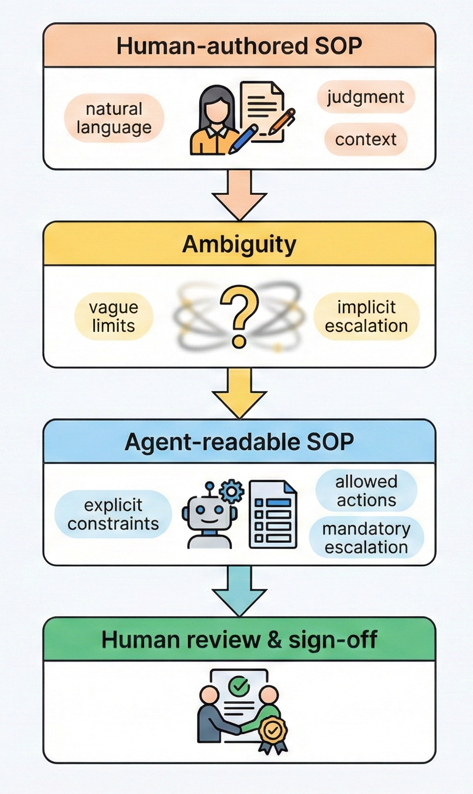

# Agent-readable-sops
Examples and notes on restructuring human-authored SOPs into explicit, agent-readable representations that remove ambiguity through defined inputs, limits, decision points, allowed actions, and escalation rules. Intended to support AI-assisted interpretation and drafting, with mandatory human review, approval, and traceable sign-off.
# Agent-readable SOPs

Standard Operating Procedures (SOPs) in regulated manufacturing environments are typically written for human interpretation. They rely on:
 - contextual understanding
 - implicit judgment
 - discretionary escalation.
These characteristics are workable for trained operators but become unsafe when SOPs are consumed by AI systems or automated agents.

This repository contains notes and examples exploring how human-authored SOPs can be restructured into explicit, agent-readable representations that remove ambiguity through defined inputs, limits, decision points, allowed actions, and escalation rules. All agent-readable forms are intended to remain subject to mandatory human review, approval, and traceable sign-off.

---

## The core problem

Most SOPs assume that the reader:
- understands operational context
- can interpret vague language safely
- knows when to escalate outside written steps
- will not act beyond intent

AI agents do not share these assumptions.

When SOPs are reused directly by AI systems, ambiguity is not a feature. It becomes an execution risk.

---
## The problem in practice

## Human SOPs vs agent-readable SOPs

Human SOPs are written to guide behavior.  
Agent-readable SOPs must constrain behavior.

### Key differences

Human SOPs are written to "guide behavior" under training and supervision.  
Agent-readable SOPs are written to "constrain behavior" under explicit rules.

- Human SOPs tolerate ambiguity; agent-readable SOPs must eliminate it.
- Human SOPs rely on judgment; agent-readable SOPs encode decision boundaries.
- Human SOPs assume escalation culture; agent-readable SOPs require escalation rules.
- Human SOPs imply authority; agent-readable SOPs declare and restrict authority.

This repository does not argue that one replaces the other. It shows why they cannot be the same artifact.

---

## What is included

This repository includes:

- A lightweight notation for expressing agent-readable SOP constraints
- Paired examples of the same SOP written for:
  - human readers
  - agent consumption
- Commentary highlighting where ambiguity was removed and why

The examples include a pharma temperature excursion SOP and a food and beverage CCP temperature monitoring SOP, demonstrating the same structuring approach across different regulated domains.  The concepts are broadly applicable to any environment where non-human actors interact with SOP-governed processes.

---

## What this is not

This repository is **not**:
- a workflow engine
- an execution system
- a compliance platform
- a proposal for autonomous decision-making

It does not attempt to automate SOP execution. It focuses only on how SOP intent must be expressed if non-human actors are expected to interact with them safely.

---

## Repository structure

agent-readable-sops/
├── README.md # Overview and context
├── spec.md # Lightweight notation for agent-readable SOPs
├── examples/ # Paired human and agent-readable SOP examples
│ ├── pharma_deviation/
│ │ ├── sop_human.md
│ │ └── sop_machine.yaml
│ └── fnb_ccp_monitoring/
│ ├── sop_human.md
│ └── sop_machine.yaml
└── notes.md # Additional observations and open questions

Each example pairs a conventional human-readable SOP with an explicit, agent-readable representation of the same process.

---

## Scope and intent

This repository is intentionally narrow in scope.

It is published as a technical note with concrete examples, not as a complete standard or framework. The material is provided to support inspection, reuse, or extension by others, without implying production readiness or endorsement.
Each example pairs a conventional human-readable SOP with an explicit, agent-readable representation of the same underlying process.

---

